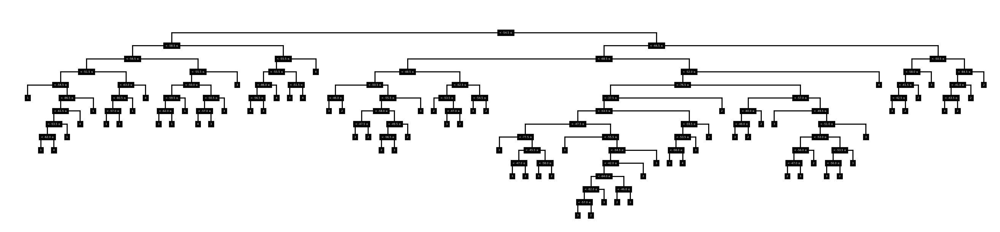

# Machine Learning Coursework: Decision Trees

<br />

## Installation guide

### Compatibility

This code was developped and tested on Ubuntu 20.04 using Python 3.9.1.

It relies on the following dependencies:
 - NumPy
 - MatPlotlib

### Installation process

#### Getting the codebase

In order to use the codebase, it first needs to be cloned to your local machine using `$ git clone https://github.com/jjlehner/ML_cw_dec_tree.git` in the parent folder you want the codebase to be in.

You can then enter the project folder using `$ cd ML_cw_dec_tree`.

#### Accessing the main script or creating a new one

An example script using our codebase is in [main.py](/source/main.py) and performs step 3 and 4 for the noisy and clean dataset. Open this file to modify it, or to see how to write your own script using the existing codebase.

If you decide to create a new seperate script, simply import the library with the following code:

```python
    from decision_tree import *
```


<br />

## Using the Library

### Loading training and testing databases

Any dataset can be loaded into the script as a `numpy.ndarray` using 

```python
    my_dataset = load_dataset('path_to_dataset_file')
```

### Learning process

To generate a decision tree based on a training dataset, use the `decision_tree_learning` function that has the following signature:

```python
    decision_tree_learning(dataset: np.ndarray, pruning: bool = False, verbose: bool = False) -> DTCN
```
Where `DTCN` is the return type of the function, and is a `DecisionTreeClassfierNode`, the root node of the tree. Two optional named parameters are also exposed:

- `pruning`: a boolean that indicates if the function should prune the tree after it is generated.
- `verbose`: a boolean that indicates if the function should print the evaluation metrics of the tree tested with cross-validation on a subset of the training dataset.

For example, the function can therefore be called as follows on our custom dataset:

```python
    my_tree = decision_tree_learning(my_dataset, pruning=True)
```

#### Bonus: Drawing the learned tree

The resulting tree of the learning process can be printed out using the `draw` function with the `DTCN` (`DecisionTreeClassifierNode`) object as argument:

```python
    draw(my_tree)
```

And this will output a similar image as the one below:

<p align="center">
    
</p>

### Testing the tree

The tree generated from the `decision_tree_learning` function, can be evaluated using the `evaluate` function. This function has the following signature:

```python
    evaluate(test_db: np.ndarray, trained_tree: DTCN) -> float:
```

Where `test_db` is an numpy array containing the input test samples, and `trained_tree` takes a `DTCN` object: the root of the decision tree.

This function returns the **accuracy** of the decision tree evaluated on the test dataset.

It can, for example, be called as follows:

```python
    evaluate(my_test_dataset, my_tree)
```

### Running the script

The `main.py` script now being completed, it can be ran by typing `$ python main.py` or `$ python3 main.py` in the terminal, depending on your Python installation.
